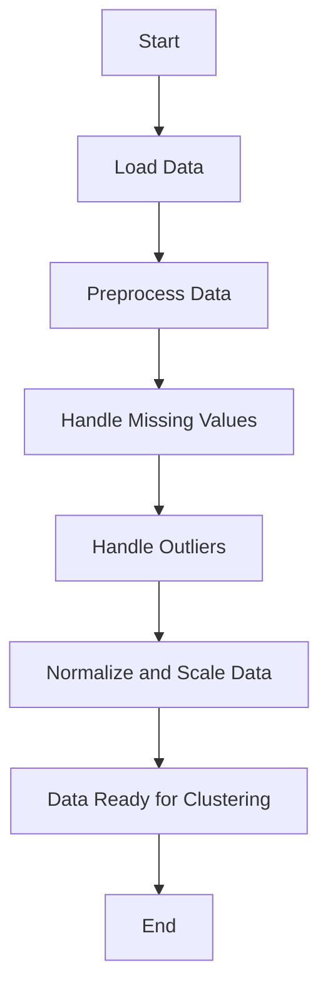

# loaddata

This project is focused on loading and processing data for clustering analysis. The goal is to efficiently handle large datasets and prepare them for clustering algorithms.

## Features

- Load data from various sources
- Preprocess data for clustering
- Handle missing values and outliers
- Normalize and scale data

## Installation

To install the necessary dependencies, run:

```bash
pip install -r requirements.txt
```

## Usage

To load and preprocess your data, use the following command:

```bash
python loaddata.py --input your_data.csv --output processed_data.csv
```

## Workflow


